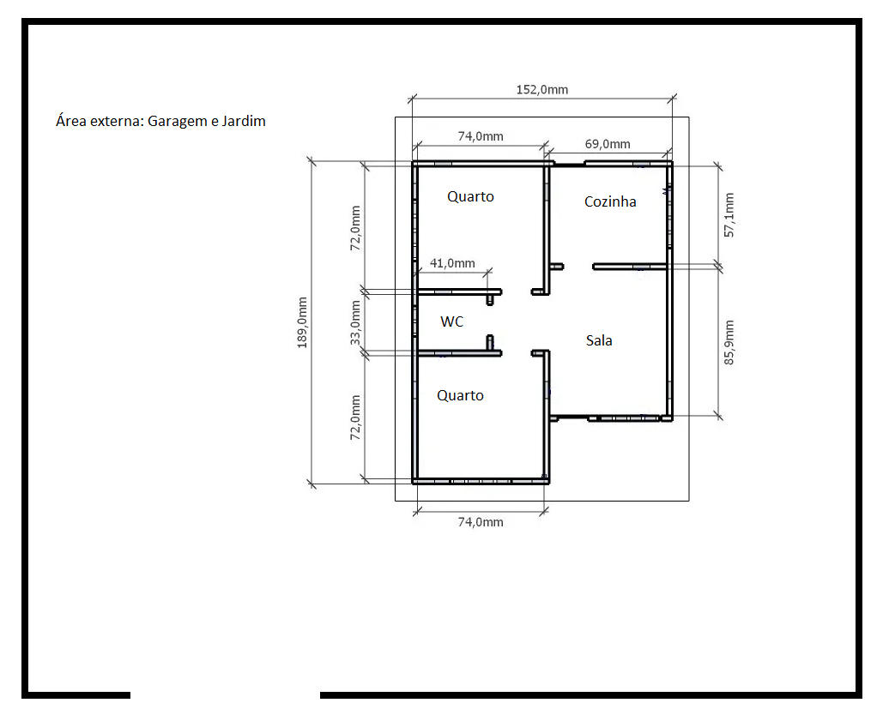

# Concepção do Projeto

A premissa do projeto é construir o protótipo de uma residência automatizada, para que os conceitos de domótica sejam aplicados.

Esta é a planta baixa da residência:

* Requisitos:

1. Controlar a iluminação dos cômodos.

2. Controle dos LEDs de forma remota (com o PC).

3. Sensor de presença para o jardim.

4. Sensor de gás.

5. Servomotor portão eletrônico.

* Objetivos:

1. Realizar o controle da iluminação dos cômodos, com o intuito de economizar energia. (Controle dos LEDs)
2. Sensor de presença para o jardim, com o intuito de economizar energia e também acrescentando aspectos de segurança ao projeto.
3. Sensor de gás na cozinha, para evitar acidentes domésticos - acionando um buzzer para servir como alarme para as pessoas e o cooler, que simula um exaustor, para retirar o gás inflamável do ambiente o mais rápido possível.
4. Servomotor para controle de acesso à residência.
5. Realizar tudo de maneira remota.

