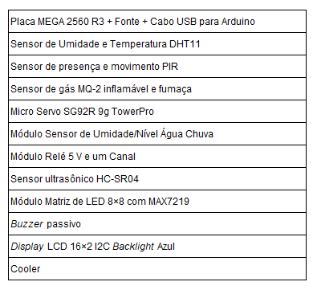

# Concepção do Projeto

A premissa do projeto é construir o protótipo de uma residência automatizada, para que os conceitos de domótica sejam aplicados.

Esta é a planta baixa da residência:

* Tecnologias do Projeto:

* Requisitos:

1. Controlar a iluminação dos cômodos.

2. Realizar o controle de acesso à residência.

3. Sistema de segurança na área externa.

4. Realizar o controle de irrigação do jardim. 

4. Sistema de prevenção a acidentes com gás de cozinha.

5. Realizar todos os controles de maneira remota.

* Objetivos:

1. Realizar o controle de iluminação dos cômodos, com o intuito de economizar energia. (Controle da matriz de LEDs).
2. Utilizar o Sensor de Presença PIR para a área externa, com o intuito de implementar um sistema de alarme junto ao buzzer.
3. Utilizar o Sensor de Gás MQ-2 na cozinha, para evitar acidentes domésticos - (depois de um certo nível de gás no ambiente, acionar um cooler que irá simular um exaustor, será necessário utilizar o módulo relé para acionar o cooler).
4. Realizar o controle de acesso à residência, portão eletrônico (utilização do servomotor).
5. Utilizar o Sensor de Temperatura e o Sensor de Nível da Água da Chuva para controle do sistema de irrigação do jardim.
6. Utilizar o LCD para visualização de dados.
7. Realizar os controles de maneira remota (utilizando o PC).

