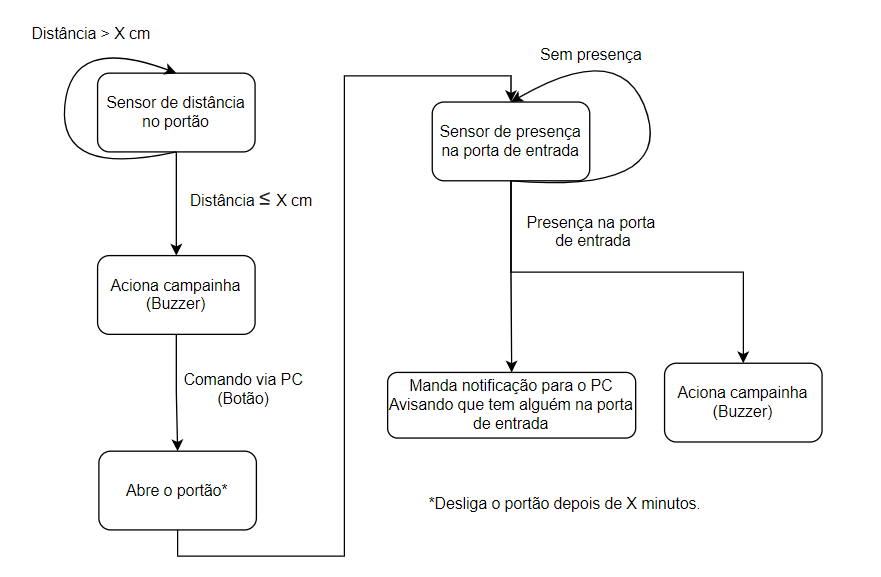
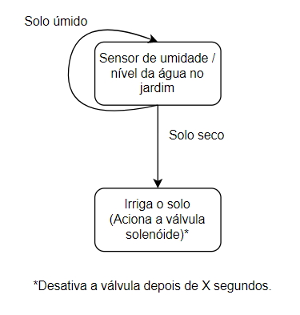
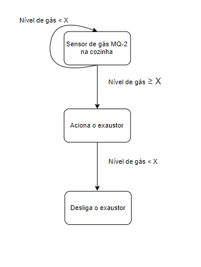

# Concepção do Projeto

A premissa do projeto é construir o protótipo de uma residência automatizada, para que os conceitos de domótica sejam aplicados.

### Requisitos/Objetivos:

1. Realizar o controle de acesso à residência.

2. Realizar o controle de irrigação do jardim. 

3. Sistema de prevenção a acidentes com gás de cozinha.

4. Apresentar os dados dos sensores no LCD.

5. Utilizar o sensor de temperatura na sala de estar e exibir o valor da temperatura na matriz de LED. 

6. Realizar todos os controles de maneira remota.

### Tecnologias do Projeto:

|  Componentes Eletrônicos                           |
| -------------------------------------------------- |
| Placa MEGA 2560 R3 + Fonte + Cabo USB para Arduino |
| Sensor de Umidade e Temperatura DHT11 |
| Sensor de presença e movimento PIR |
| Sensor de gás MQ-2 inflamável e fumaça |
| Micro Servo SG92R 9g TowerPro |
| Módulo Sensor de Umidade/Nível Água Chuva |
| Módulo Relé 5 V e um Canal |
| Sensor ultrasônico HC-SR04 |
| Módulo Matriz de LED 8×8 com MAX7219 |
| Buzzer passivo |
| Display LCD 16×2 I2C Backlight Azul |
| Cooler |
| Válvula solenóide ou Mini Bomba D'água Submersiva |

