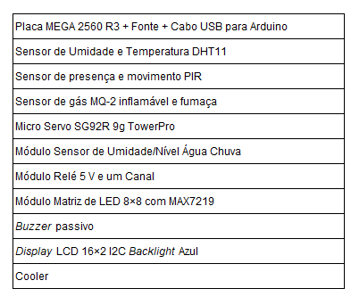
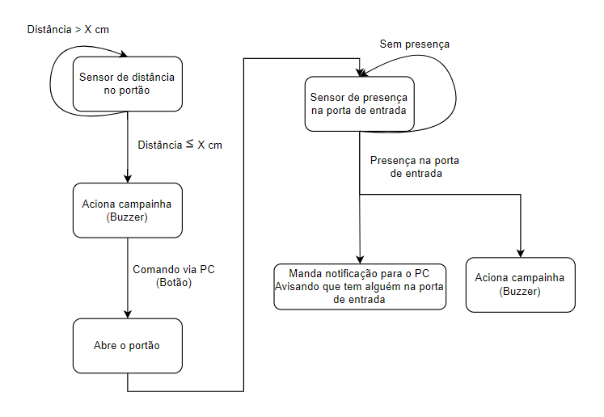
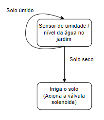
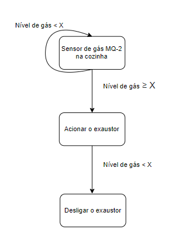

# Concepção do Projeto

A premissa do projeto é construir o protótipo de uma residência automatizada, para que os conceitos de domótica sejam aplicados.

* Tecnologias do Projeto:

* Requisitos:

1. Realizar o controle de acesso à residência.

2. Realizar o controle de irrigação do jardim. 

4. Sistema de prevenção a acidentes com gás de cozinha.

5. Realizar todos os controles de maneira remota.

