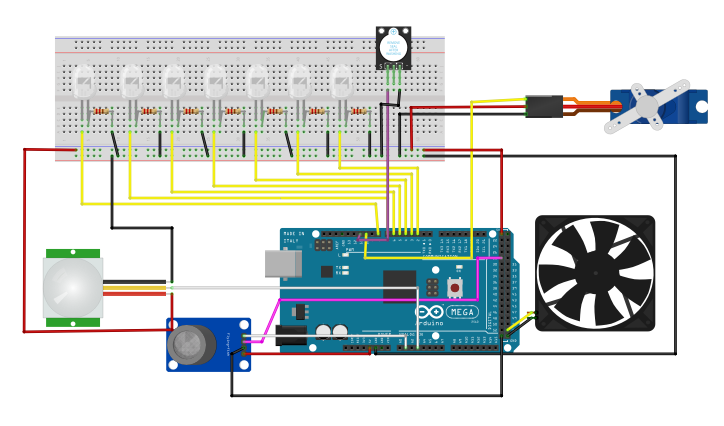

# Design de Projeto

Na figura abaixo está o esboço do projeto, todos os componentes são necessários para cumprir os requisitos listados na [Concepção do Projeto](https://github.com/maiteluisaa/projeto_pi2/blob/main/concep.md).

**Lista de Materiais:**

- 6 LEDS
- 1 Micro cooler (5V)
- 1 Sensor MQ-2
- 1 Buzzer (KY-012)
- 1 Servomotor (SG90)
- 1 Sensor PIR
- 1 Arduino Mega 2560
- 6 Resistores de 220Ω
- 1 Protoboard
