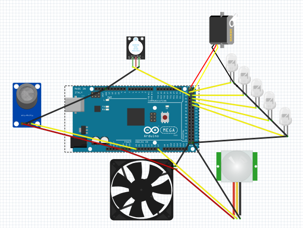
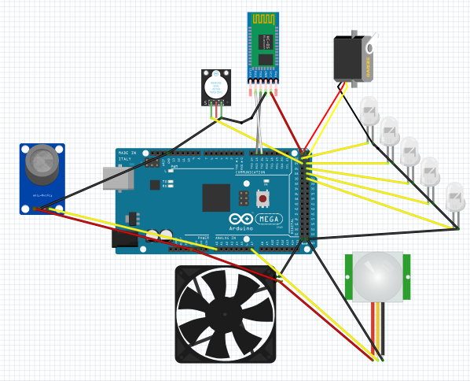

# Design de Projeto

Na figura abaixo está o esboço do projeto, todos os componentes são necessários para cumprir os requisitos listados na [Concepção do Projeto](https://github.com/maiteluisaa/projeto_pi2/blob/main/concep.md).

**Lista de Materiais:**

- 5 LEDS
- 1 Cooler
- 1 Sensor MQ-5
- 1 Buzzer (KY-012)
- 1 Servomotor (SG90)
- 1 Sensor PIR
- 1 Arduino Mega 2560

A princípio o cumprimento do requisito de realizar os comandos de maneira remota será feito de maneira usb, porém estuda-se o caso para saber se é viável desenvolver um app para fazer a comunicação via bluetooth, dessa maneira a lista de materiais seria acrescentada com o seguinte item:

- 1 Módulo bluetooth HC-05

