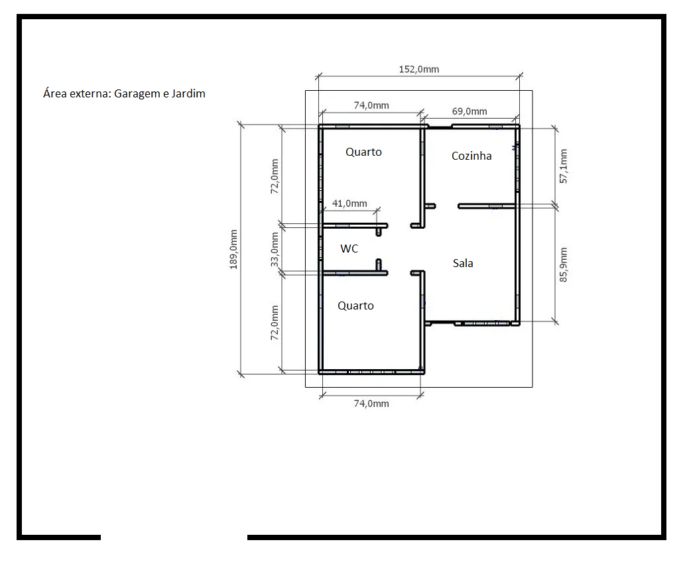

# Design de Projeto

Planta baixa da residência:

|  Componentes Eletrônicos                           | Cômodo     |
| -------------------------------------------------- | ---------- |
| Sensor de Umidade e Temperatura DHT11 |      Área Externa (Jardim)    |
| Sensor de presença e movimento PIR |      Área Externa (Porta da Frente)     |
| Sensor de gás MQ-2 inflamável e fumaça |      Cozinha     |
| Micro Servo SG92R 9g TowerPro |     Portão da Garagem    |
| Módulo Sensor de Umidade/Nível Água Chuva |      Área Externa (Jardim)     |
| Sensor ultrasônico HC-SR04 |      Portão da Garagem       |
| Módulo Matriz de LED 8×8 com MAX7219 |      Sala    |
| Buzzer passivo |      Sala     |
| Display LCD 16×2 I2C Backlight Azul |      Sala     |
| Cooler |      Cozinha e Sala     |
| Mini Bomba D'água Submersiva |      Área Externa (Jardim)     |
